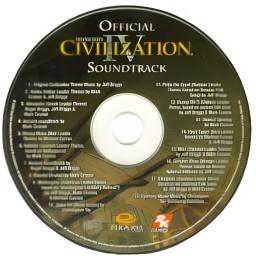

# Civ IV Sounds for Unciv

Provides some of IV's sounds in [Unciv](https://github.com/yairm210/Unciv).

## Installation

1. Open Unciv
2. Open the Mods menu
3. Click Sort and Filter
4. Search for "Civ IV Music"
5. Download and install
6. Enable "Permanent audiovisual mod"
